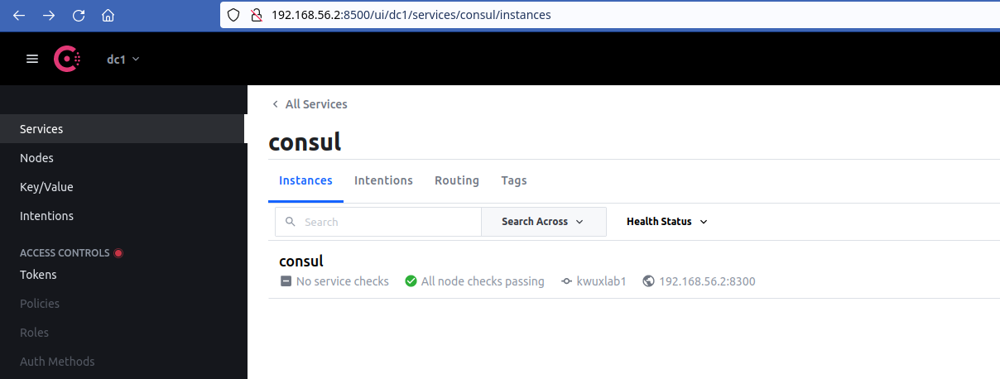

# Kwuxlab Free - Ansible Playbooks

Ansible playbooks to configure your Hashicorp (Consul, Vault, Nomad) cluster.

Note: the free version is considered a playground environment, which will get you
up-and-running with a Hashicorp cluster quickly, but is missing a number of
bells-and-whistles that you may want in a more stable environment.

## Features

1. [Infrastructure Environment](/infrastructure/README.md)
   - [ ] ( :no_entry_sign: - Kwuxlab Pro Only) Terraform modules and Terragrunt configuration for
     deployment on
     - [x] :heavy_check_mark: Hetzner Cloud
     - [ ] AWS
     - [ ] GCP
     - [ ] Azure
   - [x] :heavy_check_mark: Virtual machine deployment via [Vagrant](https://www.vagrantup.com/)

2. [Basic compute environment configuration](/ansible/playbooks/kwuxlab_free_common_base/README.md),
including basic security/quality-of-life settings:
   - [ ] ( :no_entry_sign: - Kwuxlab Pro Only) Non-root sudoer user creation
      - Includes configuration to allow non-root user with Ansible
   - [ ] ( :no_entry_sign: - Kwuxlab Pro Only) Log-rotation & Journalctl max disk usage settings
   - [ ] ( :no_entry_sign: - Kwuxlab Pro Only) NTP installation/configuration to avoid time-drift
   - [ ] ( :no_entry_sign: - Kwuxlab Pro Only) Base firewall configuration via the Uncomplicated Firewall ([UFW](https://wiki.ubuntu.com/UncomplicatedFirewall))
   - [ ] ( :no_entry_sign: - Kwuxlab Pro Only) Secure SSH configuration
      - Includes configuration of authorized_hosts file
   - [ ] ( :no_entry_sign: - Kwuxlab Pro Only) Fail2Ban configuration
   - [ ] ( :no_entry_sign: - Kwuxlab Pro Only) Hostname configuration
   - [ ] ( :no_entry_sign: - Kwuxlab Pro Only) Tailscale installation & bootstrapping
   - [ ] ( :no_entry_sign: - Kwuxlab Pro Only) Stateful storage with details of 
     ansible playbook execution (version, etc.) on remote
     host for future debugging/upgrade reference.
   - [x] :heavy_check_mark: [Docker installation & base configuration](/ansible/playbooks/kwuxlab_free_common_base/README.md)
   - [x] :heavy_check_mark: [Python/python3-pip installation/configuration](/ansible/playbooks/kwuxlab_free_common_base/README.md)
   - [x] :heavy_check_mark: [Envoy proxy installation/base configuration](/ansible/playbooks/kwuxlab_free_common_base/README.md)

3. [Consul deployment/configuration](/ansible/playbooks/kwuxlab_free_service_consul/README.md)
   - [ ] ( :no_entry_sign: - Kwuxlab Pro Only) Service (all ports) bound to private (tailscale)
     network; not accessible via internet.
   - [ ] ( :no_entry_sign: - Kwuxlab Pro Only) Configure [Consul DNS](https://developer.hashicorp.com/consul/docs/discovery/dns)
     (Service discovery via DNS)
   - [ ] ( :no_entry_sign: - Kwuxlab Pro Only) Configure and enable
     [Consul Access Control Lists (ACLs)](https://developer.hashicorp.com/consul/tutorials/security/access-control-setup-production)
   - [x] :heavy_check_mark: [Consul Server/Client deployment and bootstrap](/ansible/playbooks/kwuxlab_free_service_consul/README.md)

4. [Vault deployment/configuration](/ansible/playbooks/kwuxlab_free_service_vault/README.md)
    - [ ] ( :no_entry_sign: - Kwuxlab Pro Only) Service (all ports) bound to private (tailscale)
      network; not accessible via internet.
    - [ ] ( :no_entry_sign: - Kwuxlab Pro Only) Integrate with Consul via ACL token
    - [x] :heavy_check_mark: Basic Vault installation

5. [Nomad deployment/configuration](/ansible/playbooks/kwuxlab_free_service_nomad/README.md)
    - [ ] ( :no_entry_sign: - Kwuxlab Pro Only) Service (all ports) bound to private (tailscale)
      network; not accessible via internet.
    - [ ] ( :no_entry_sign: - Kwuxlab Pro Only) Configure and manage [Host Volumes](https://developer.hashicorp.com/nomad/tutorials/stateful-workloads/stateful-workloads-host-volumes)
      for stateful workloads
    - [ ] ( :no_entry_sign: - Kwuxlab Pro Only) Dynamic integration with upstream services (Vault, Consul)
      via Consul DNS/Service Discovery
    - [ ] ( :no_entry_sign: - Kwuxlab Pro Only) Authorization with Consul via Consul ACLs
      [Consul Access Control Lists (ACLs)](https://developer.hashicorp.com/consul/tutorials/security/access-control-setup-production)
    - [ ] ( :no_entry_sign: - Kwuxlab Pro Only) Configuration & Bootstrapping of Nomad 
      [Access Control Lists (ACLs)](https://developer.hashicorp.com/nomad/tutorials/access-control/access-control)
    - [x] :heavy_check_mark: Nomad installation
    - [x] :heavy_check_mark: Consul integration
    - [x] :heavy_check_mark: Vault integration

Support Kwuxlab/InfraCasts to get these awesome features AND awesome tutorials
on how to make use of this code at https://infracasts.com

## Base host configuration & requirements

### Supported OS

- [x] Ubuntu
   - [x] 20.04 (tested using the [bento](https://github.com/chef/bento) Ubuntu image)

### Pre-requisites

1. Create the kwuxlab cluster infrastructure (machines) by following the directions
in [the infrastructure directory of this repository](/infrastructure).

2. Install and configure requirements for Ansible and this project on your host
machine (*i.e.* your local computer).

   1. Python3 must be installed.
      - If you're unfamiliar with Python, I encourage you to read the documentation at
        [virtualenv](https://virtualenv.pypa.io/en/latest/). Virtualenv will allow you
        to create a virtual python environment for the kwuxlab.
   2. Install this project's python requirements

      ```sh
      # Enter this project's ansible directory
      cd ~/projects/kwuxlab-free/ansible

      # Install python dependencies
      pip install -r requirements.txt
      ```

### Basic compute environment configuration

All of the steps below are context-dependent, and expect that your
terminal's current directory, while running the commands, is 
`kwuxlab-free/ansible`.

1. Create a `password_file.test.txt` 
   to use with
   `ansible-vault` encryption. There is no special command to create this
   file/password, choose whatever password suits your needs. Here's an example using
   `ruby`:

   ```sh
   # Enter this project's ansible directory
   cd ~/projects/kwuxlab-free/ansible

   # Note, by default, this is gitignored in this repository.
   # For alternative methods/options, check out the docs at
   # https://docs.ansible.com/ansible/latest/user_guide/vault.html
   ruby -rsecurerandom -e 'puts SecureRandom.hex(30)' >> password_file.test.txt
   ```

2. Run the `configure` script
   -  This will install and configure a number of dependent packages, including
     - `wget`
     - `ufw`
     - `docker`
     - `python` and `pip` (`pip3`)
     - `envoy`
     - etc.

   ```sh
   # 1. Run the configure bash script 
   bin/configure
   ```

3. Accept authenticity of the remote (or Vagrant) hosts (if required).

   > NOTE: You may need to enter 'yes' multiple times, and,
   > if the playbook execution looks 'stuck', it's likely waiting for input
   > (enter `yes` and press `enter`):

   ```sh
   [WARNING]: Found variable using reserved name: remote_user
   
   PLAY [Include global vars] ************************************************************************************************************************************************************************************************************
   The authenticity of host '192.168.56.3 (192.168.56.3)' can't be established.
   ECDSA key fingerprint is SHA256:9asdwJklaa0sd9fuasdfAajklszlkcalskdjf.
   Are you sure you want to continue connecting (yes/no)? yes
   ```

## Base (Hashicorp Consul/Vault/Nomad) Services installation

### Pre-requisites

None for Kwuxlab Free

### Service installation

Next, we'll provision, in a particular order-of-operations, our base services!

#### 1. Consul

Hashicorp [Consul](https://www.consul.io/) will act as our foundational network
and service layer, monitoring node state, communication, and acting as a 
light distributed data store for some of our services (*e.g.* Vault).

##### Consul Features available in Kwuxlab/InfraCasts Pro (NOT in this free playbook)

- [x] :heavy_check_mark: Configure [Consul DNS](https://developer.hashicorp.com/consul/docs/discovery/dns)
  (Service discovery via DNS)
- [x] :heavy_check_mark: Configure and enable
  [Consul Access Control Lists (ACLs)](https://developer.hashicorp.com/consul/tutorials/security/access-control-setup-production)

Support Kwuxlab/InfraCasts to get these awesome features AND awesome tutorials
on how to make use of this code at https://infracasts.com


##### Pre-requisites

1. Copy the `ansible/playbooks/kwuxlab_free_service_consul/vars/example_environment.yml`
   file to `ansible/playbooks/kwuxlab_free_service_consul/vars/test_environment.yml`.

   ```sh
   # Enter this project's ansible directory
   cd ~/projects/kwuxlab-free/ansible
   
   cp playbooks/kwuxlab_free_service_consul/vars/example_environment.yml \
      playbooks/kwuxlab_free_service_consul/vars/test_environment.yml
   ```

2. Encrypt the newly created variable file
   ```sh
   ansible-vault encrypt \
      --vault-id password_file.test.txt \
      playbooks/kwuxlab_free_service_consul/vars/test_environment.yml
   ```

3. Edit the new variable file, updating the required variables.
   ```sh
   ansible-vault edit \
      playbooks/kwuxlab_free_service_consul/vars/test_environment.yml \
      --vault-password-file password_file.test.txt
   ```
   - See the README at [kwuxlab_free_service_consul](./playbooks/kwuxlab_free_service_consul/README.md)
     for additional details about the variables listed!

##### Deploy

All of the steps below are context-dependent, and expect that your
terminal's current directory, while running the commands, is `kwuxlab-free/ansible`.

1. Provision the `consul` service across all nodes
   ```sh
   # Current directory: kwuxlab-free/ansible
   SERVICE=consul bin/provision-service
   ``` 

2. Open a browser, and visit the [Consul UI](http://192.168.56.2:8500/ui/) at
   `http://192.168.56.2:8500/ui/` (the IP address of any Vagrant server node) 

   You should see a page like:

   

   > Note: Kwuxlab Pro includes bootstrap/configuration of Consul's Access
   > Control List (ACL) system, which will place an authorization wall here,
   > and require you to log-in.


#### 2. Vault

Hashicorp [Vault](https://www.vaultproject.io/),
"secures, stores, and tightly controls access to tokens, passwords,
certificates, API keys, and other secrets in modern computing."

##### Pre-requisites

None for Kwuxlab Free

##### Deploy

All of the steps below are context-dependent, and expect that your
terminal's current directory, while running the commands, is `kwuxlab-free/ansible`.

1. Provision the `vault` service across all nodes
   ```sh
   # Current directory: kwuxlab-free/ansible
   SERVICE=vault bin/provision-service
   ``` 

##### Initialize

1. Open a browser, and visit the [Consul UI](http://192.168.56.2:8200) at
   `http://192.168.56.2:8200` (the IP address of any Vagrant server node) 
   
   You should be greeted with a similar screen to this:

   

2. Configure the details used in generating/managing the master key!
   - Enter a number of key-shares to divide the master key into. 
      - *e.g.* `10`
   - Enter a key threshold: the number of keys required in order to reconstruct
      the master key. 
     - *e.g.* `5`
   - More details on key shares and thresholds [here](https://developer.hashicorp.com/vault/docs/concepts/seal#shamir-seals)

3. Once you've entered your desired share/threshold values, and clicked 
   "Initialize", you'll be greeted with a screen containing the 
   `Initial root token` and a number of other `keys`. 

   **These are sensitive values** and should be stored in a secure location,
   where you can access them at a later time.

   Towards the bottom of the screen, there is a "Download Keys" button that
   makes it easy!

   
   

4. Once you've downloaded and secured the token and keys,
   click on the `Continue to Unseal`
   button, and begin entering some of the keys that were output in the previous
   step.

   You'll need to enter at as many as you set your key threshold to
   during the initialization process.

   

   - **IMPORTANT**: Repeat this step on **all** of the Vault Server nodes. 
     - For us, by default, that means `192.168.56.2`, `192.168.56.3`, `192.168.56.4` -
       or, those nodes
       which are configured as `consul_server=true` in our ansible [inventory file](./inventories/test/hostip.ini).
     - Repeat this on all non-server nodes to turn the Consul 
       Service status for the `Vault` service, "green."
       - All nodes, regardless of their `sealed` state should have access to the 
         `vault` binary on their `PATH`, to fetch keys and to interact best with
         Nomad/Consul Connect later on.

5. Once the vault has entered the `unsealed` state, you can log in! 

   Use the
   `Initial root token` to log into the vault website.

   

##### Configure

Finally, we'll create a non-master token for use with Consul and Nomad and
enable a key-value secrets engine.

For this step, you'll need to either SSH into a node in the cluster or
install `vault` locally on your machine.

```sh
# From within ~/projects/kwuxlab-free/infrastructure/vagrant
$ vagrant ssh node1
```

1. Create the initial Vault tokens (at the command-line).
   1. Set the vault address to localhost or tailscale
      ```sh
      # Use localhost/127.0.0.1 if connected directly to a cluster node
      export VAULT_ADDR="http://127.0.0.1:8200"
      ```
   2. Set the initial root token as `VAULT_TOKEN` (only for this generation)
      ```sh
      # NOTE: ideally the token itself would be sourced from the environment,
      # as using it in the command-line - as shown below - places it in your
      # shell's history!
      #  
      # Below is an example token; keep yours secret. Keep it safe.
      export VAULT_TOKEN="s.DbHfjh5IbGO7DbOlooLW5cK0"
      ```
   3. Run `vault token create` to create a `root` token, and store it somewhere
      secure and safe for future reference.
      ```sh
      # Below is an example output; keep yours secret. Keep it safe.
      kwuxlab_ansibler@tsnode1:~$ vault token create
      Key                  Value
      ---                  -----
      token                s.79CriBBzcm4cpFaQexmG0lHT
      token_accessor       2CcexnK1mRQKi8xW48SdWpoI
      token_duration       ∞
      token_renewable      false
      token_policies       ["root"]
      identity_policies    []
      policies             ["root"]
      ```

2. And lastly, let's enable `kv-v1` key-value storage engine so that we can
   begin storing and fetching secrets!
   1. Use the token from the previous step to authenticate and enable the engine
      at the command-line:
      ```sh
      # Ensure that VAULT_ADDR and VAULT_TOKEN have been set in your environment
      # prior to running this command, as shown above.
      vagrant@kwuxlab1:~$ vault secrets enable -path="kv-v1" kv
      Success! Enabled the kv secrets engine at: kv-v1/
      ```
   2. Store a test secret:
      ```sh
      vault kv put kv-v1/test/example/partition hello=world
      ```
   3. Our new secret can be seen in the [Vault UI](http://tsnode1:8200/ui/vault/secrets/kv-v1/show/test/example/partition)
      by clicking on the `kv-v1` > `test` > `example` > `partition` links successively 

      
      
      and, by clicking on the little `eye` icon, we can reveal the value of our 
      first secret!

      
   4. To fetch the secret over the command-line:
       ```sh
      vault kv get kv-v1/test/example/partition
      ```   

#### 4. Nomad

Hashicorp [Nomad](https://www.nomadproject.io/) is, "A simple and flexible 
scheduler and orchestrator to deploy and manage containers and 
non-containerized applications across on-prem and clouds at scale."

##### Pre-requisites

1. Copy the `ansible/playbooks/kwuxlab_free_service_nomad/vars/example_environment.yml`
   file to `ansible/playbooks/kwuxlab_free_service_nomad/vars/test_environment.yml`.

   ```sh
   # Enter this project's ansible directory
   cd ~/projects/kwuxlab-free/ansible

   # Copy the `example` environment variables file to a `test` environment file
   cp playbooks/kwuxlab_free_service_nomad/vars/example_environment.yml \
      playbooks/kwuxlab_free_service_nomad/vars/test_environment.yml
   ```

2. Encrypt the newly created variable file
   ```sh
   ansible-vault encrypt \
      --vault-id password_file.test.txt \
      playbooks/kwuxlab_free_service_nomad/vars/test_environment.yml
   ```

3. Edit the new variable file, updating the required variables.
   ```sh
   ansible-vault edit \
      playbooks/kwuxlab_free_service_nomad/vars/test_environment.yml \
      --vault-password-file password_file.test.txt
   ```
   - See the README at [kwuxlab_free_service_nomad](./playbooks/kwuxlab_free_service_nomad/README.md)
     for additional details about the variables listed!

##### Deploy

All of the steps below are context-dependent, and expect that your
terminal's current directory, while running the commands, is `kwuxlab-free/ansible`.

1. Provision the `nomad` service across all target Nomad **server** nodes.
   For our purposes, our Consul server nodes will also double as our 
   Nomad server nodes, so we'll filter for those hosts:
   ```sh
   # Current directory: kwuxlab-free/ansible
   PLAYBOOK_HOSTS=consul_servers SERVICE=nomad bin/provision-service
   ``` 

2. Next, we'll provision the `nomad` service across all **client** nodes.
   ```sh
   # Current directory: kwuxlab-free/ansible
   PLAYBOOK_HOSTS=consul_clients SERVICE=nomad bin/provision-service
   ``` 

##### Initialize

No initialization of Nomad Access Control Lists (ACLs) in Kwuxlab Free, so we're
done!

- Open a browser, and visit the [Consul UI](http://192.168.56.2:4646) at
   `http://192.168.56.2:4646` (the IP address of any Vagrant server node) 

- Click on the `servers` tab to view the Nomad server agents

  

- And, clicking on the `clients` tab should show the expected
  client nodes

  
